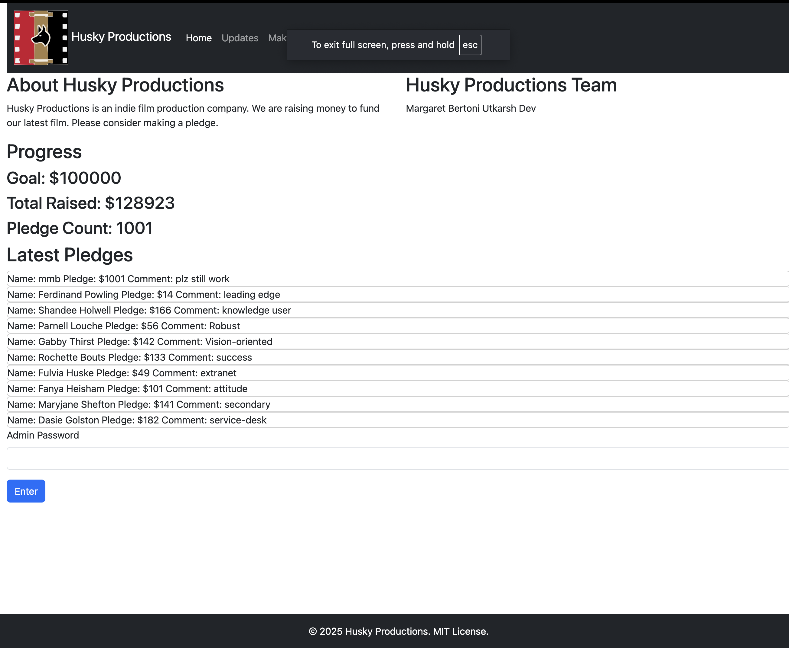
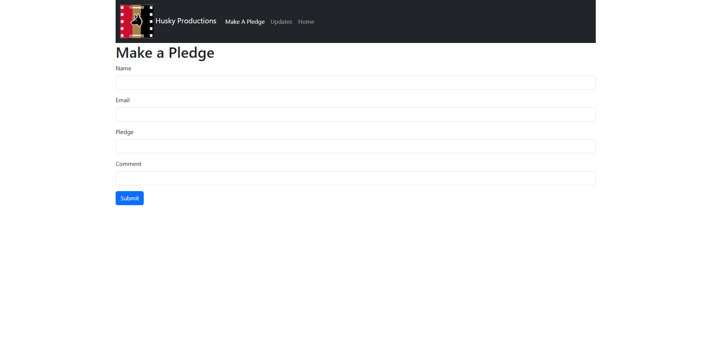
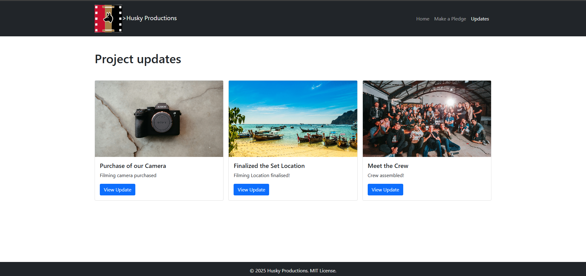
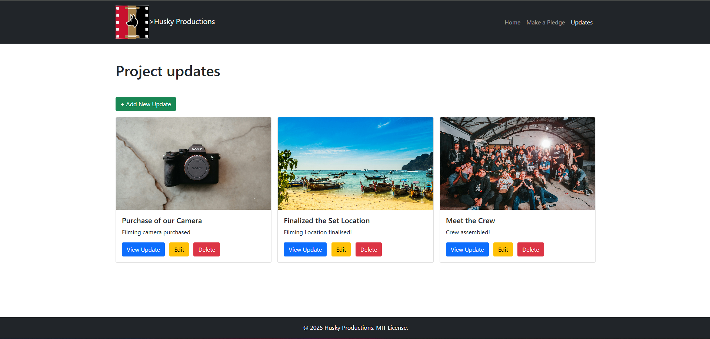
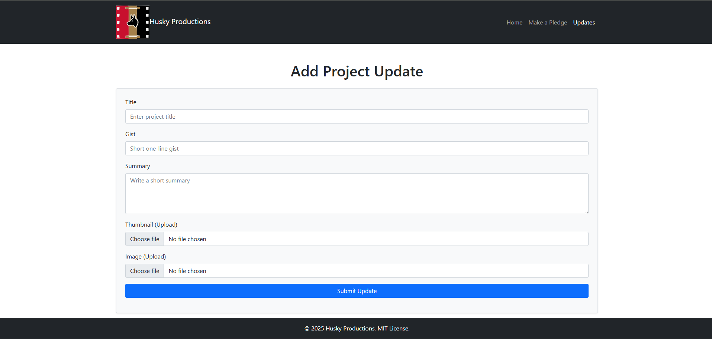

# FundFilm- Film Fundraising Platform
A web application that enables independent film directors to share project updates and receive pledges from supporters without needing technical expertise.
# Authors
Margaret Bertoni

Utkarsh Dev

# Deployed Link
[FundFilm website](https://fundfilm-m5jq.onrender.com/index.html)
(Note: Admin password to access pledge edits is 123).

# Class Link
[WebDev Class](https://johnguerra.co/classes/webDevelopment_online_fall_2025/)

# Presentaion
[Slideshow](https://docs.google.com/presentation/d/1UFH4DyQjiIXMOowoZACeb2gC7bVSin55ovFL7kZcklg/edit?usp=sharing)

# Design Document
[Docs](https://docs.google.com/document/d/1LA_lnzoM07tAgFtU58Ea87D0XSlqcDgwVyYUqaciMsA/edit?usp=sharing)

# Video Demo
[Demo link](https://youtu.be/i1kSiApBJS0)

# Project Objective
FundFilm simplifies film fundraising by providing directors with an easy-to-use platform to:

Share behind-the-scenes updates and project progress
Engage directly with supporters without technical knowledge
Track funding goals and pledges in real-time
Build community around their film projects

The platform serves multiple user stories:

Film Directors: Post updates quickly without dealing with technical complexities
Film Fans: Stay informed about project developments
Prospective Patrons: Learn about films and pledge support
Film Producers: Monitor donor details and manage communications

# Screenshot

Homepage

Pledges form

Updates page

Updates page with key

Add updates form

# Features
For Directors & Producers

Private Update Form: Accessible via direct link (not in navbar) for secure posting
Quick Dashboard: View donor count and total funds raised at a glance
Simple Update Interface: Post project updates without formatting knowledge
Donor Management: Access detailed information about supporters

For Supporters & Fans

Project Overview: Learn about the film, director, and team
Pledge System: Support projects with simple pledge forms (no payment processing)
Transparency: View total funds raised and all pledges
Updates Feed: Follow project progress with director updates

# Project Structure
Pages

Home Page with Director/team Info and Pledge Info
Pledge Form
Updates Submission Form (Private Link Only)
Updates Page

# Instructions to Build

Quick summary
- Recommended Node.js: v18+ (Express v5 and some dev tools expect modern Node).
- Tested on macOS. MongoDB (local or Atlas) required.

Prerequisites (mac)
- Homebrew (optional): /bin/bash -c "$(curl -fsSL https://raw.githubusercontent.com/Homebrew/install/HEAD/install.sh)"
- Node.js v18+ — install with Homebrew: brew install node@18
- MongoDB: use MongoDB Atlas or install locally:
  - brew tap mongodb/brew && brew install mongodb-community
  - Start local MongoDB: brew services start mongodb-community

Install and run locally
1. Clone and open project
   - git clone <repo-url>
   - cd FundFilm
   - The primary branch is *margaret-testing* (we worked on separate branches & tried to merge into main but ran into issues, so ultimately Margaret pulled Utkarsh's files to her branch and manually merged)

2. Install dependencies
   - npm install

3. Environment
   - Create a file named .env at project root. Example:
     PORT=3000
     MONGO_URI=mongodb://localhost:27017/fundfilm
     SESSION_SECRET=change_this_secret
     NODE_ENV=development
   - If using MongoDB Atlas, set MONGO_URI to the Atlas connection string.

4. Run the app
   - npm start
     - package.json "start" uses nodemon to run backend.js
   - To run without nodemon (production-like): NODE_ENV=production node backend.js

5. Database seeding (optional)
   - There is no seed script in package.json. If you need sample data:
     - Add a seed script (e.g., scripts/seed.js) and run with node scripts/seed.js
     - Or insert documents manually via MongoDB Compass / mongo shell / Atlas UI.

How to verify
- Open http://localhost:3000 (or the PORT you set).
- Check API endpoints (example):
  - curl http://localhost:3000/api/pledges
  - curl http://localhost:3000/updates

Troubleshooting
- "npm start" fails because port in use:
  - lsof -i :3000
  - kill <PID>
- MongoDB connection errors:
  - Verify MONGO_URI and that MongoDB is running.
  - If using Atlas, whitelist your IP or use 0.0.0.0/0 for demos (not recommended for production).
- Wrong Node version: check with node -v and use nvm or Homebrew to switch.
- Missing script / different entry file:
  - Inspect package.json to confirm start script and entry file (package.json currently runs backend.js via nodemon).

Notes
- package.json uses nodemon in the start script. For CI / production, run node backend.js or add a separate production script.
- Update .env and package.json scripts if your entry file or DB details differ.

# Work Distribution
Utkarsh

Director and producer user stories implementation
Private updates form with secure link access
Updates database schema and API
Updates display page

Margaret

Pledgee and film fan user stories implementation
Homepage design and content
Pledge form and database integration
Pledges page with fundraising totals

# AI Usage

This README was initially generated using Claude Sonnet 4.5 using the following query: 
*Help me generate a README file for the FundFilm repo that has the following:   Author Class Link :https://johnguerra.co/classes/webDevelopment_online_fall_2025/ Project Objective : Screenshot  Instructions to build  AI Usage section. and showcasing the following info... [pulled from Project Proposal]:* 
The build instructions were developed with Github Copilot GPT-5 mini based on the package.json file and the existing README.

The logo was made using Adobe Illustrator's GenAI image generator. Asked it to make a logo for a film production company called "Husky Productions" using the Northeastern University colors.

When deploying to Render, there were deployment errors. Screenshots of the error log were submitted to Claude Sonnet 4.5 to help explain and troubleshoot what was causing the deployment issue. 

Asked Claude Sonnet 4.5 questions about Express and Mongo to better understand routing, like the following question: *As a full stack engineer, help me to learn how to get data out of a form where the submission is a http post type using Express* or *As a full stack engineer, without coding for now, please explain how you can redirect a user to another page using Express* , *As a full stack engineer, can you explain to me how to use the mongo node driver to add a new document using Express routes* 

Initially was revealing the connection key to MongoDB Atlas. Asked Claude to explain what options there were for not revealing the key: *As a fullstack engineer, without coding yet, explain how to access a mongodb collection without publicalyy revealing the password* 

# Technologies Used

Frontend: HTML, CSS, Bootstrap, JavaScript
Backend: Node.js, Express
Database: MongoDB (Atlas)

# Design Doc
[text](<Project 2 design doc.pdf>)

# License
MIT
